<div align="center">

```
╔═══════════════════════════════════════════════════════════════╗
║  AI ARCHITECT · APPLIED LLM ENGINEERING · AGENTIC WORKFLOWS  ║
╚═══════════════════════════════════════════════════════════════╝
```

</div>


### `$ whoami`

Backend developer & AI engineer. I don't just build API wrappers —  
I architect autonomous intelligence that's actually production-ready.

Multi-agent workflows. Advanced RAG pipelines. Local LLMs running  
on a 4070 Super, because cloud credits are for people who haven't  
done the math yet.

Exponential learner. Also a drummer. Rhythm applies to both.

```python
kaan = {
    "focus":    ["LangGraph", "RAG", "Agentic Systems"],
    "stack":    ["Python", "TypeScript", "Node.js"],
    "infra":    ["Docker", "Linux", "LangSmith"],
    "hardware": "RTX 4070 Super (yes, for LLMs)",
    "motto":    "maximum performance · minimum waste",
}
```

<br clear="right"/>

---

## 📊 Metrics

<table width="100%">
  <tr>
    <td width="50%">
      
    </td>
    <td width="50%">
      
    </td>
  </tr>
</table>

<!-- Advanced metrics (isometric calendar + language analysis) via lowlighter/metrics -->
<div align="center">

</div>

---

## 🔒 Enterprise Work

> _The real stuff is private, but here's what I've been building:_

| Project         | Description                                                                                | Stack                                  |
| --------------- | ------------------------------------------------------------------------------------------ | -------------------------------------- |
| **ElektraAI**   | Enterprise-grade modular AI suite — decoupled Solvers, Summarizers, Context Verifiers      | TypeScript · Vercel AI SDK · LangGraph |
| **Valori Core** | Autonomous multi-agent system · ultra-low latency · local model deployment · offline-first | Python · LangGraph · Docker            |

---

## 🚀 Featured Projects

<table width="100%">
  <tr>
    <td width="50%">
      <a href="https://github.com/becksanswerr/node-efficiency-index">
        
      </a>
    </td>
    <td width="50%">
      <a href="https://github.com/becksanswerr/CVScore-AI">
        
      </a>
    </td>
  </tr>
  <tr>
    <td colspan="2">
      <a href="https://github.com/becksanswerr/Landy-AI-Agent-Assistant-For-Companies">
        
      </a>
    </td>
  </tr>
</table>

---

## 🛠️ Tech Stack

**AI & Data**  


**Languages**  


**Backend & Infrastructure**  


**Dev Tools**  


---

<div align="center">
<sub><code>// Istanbul, TR · Open to remote · Building things that matter</code></sub>
</div>
