<div align="center">

```
╔═══════════════════════════════════════════════════════════════╗
║  AI ARCHITECT · APPLIED LLM ENGINEERING · AGENTIC WORKFLOWS  ║
╚═══════════════════════════════════════════════════════════════╝
```

</div>

### `$ whoami`

Backend developer & AI engineer. I don't just build API wrappers —  
I architect autonomous intelligence that's actually production-ready.

Multi-agent workflows. Advanced RAG pipelines. Local LLMs running  
on a 4070 Super, because cloud credits are for people who haven't  
done the math yet.

Exponential learner. Also a drummer. Rhythm applies to both.

Building autonomous AI systems with local-first infrastructure,
production-grade agent workflows, and zero tolerance for wasted compute.

**Maximum performance. Minimum waste. Autonomous everything.**

---

## 📊 Metrics

<table width="100%">
  <tr>
    <td width="50%" valign="top">
      
    </td>
    <td width="50%" valign="top">
      
    </td>
  </tr>
</table>

---

## 🔒 Enterprise Architecture

> _Due to NDA, the real stuff is private. Here is an architectural overview of my recent implementations:_

| Project         | Description                                                                                                        | Tech Stack                                                          |
| :-------------- | :----------------------------------------------------------------------------------------------------------------- | :------------------------------------------------------------------ |
| **ElektraAI**   | Enterprise-grade modular AI suite. decoupled Solvers, Summarizers, and Context Verifiers.                          | TypeScript · LangGraph · LangSmith · ExpressJS · Redis · PostgreSQL |
| **Generic AI**  | Zero-code autonomous AI architecture. Dynamically generates and routes agent workflows for system-wide automation. | TypeScript · LangGraph · LangSmith · ExpressJS · Redis · PostgreSQL |
| **Valori Core** | Autonomous multi-agent system focusing on ultra-low latency, local model deployment, and offline-first execution.  | Python · LangGraph · Docker · Redis · PostgreSQL                    |

<details>
<summary><strong>📐 Architecture Sample — Online Reservation Voice Agent</strong></summary>

<br/>

> A real-time voice + text reservation agent built with LangGraph. Features parallel STT/TTS pipelines, barge-in detection, and a stateful multi-node coordinator pattern.


</details>

---

## 🛠️ Tech Stack

**AI & Data**  


**Languages**  


**Backend & Infrastructure**  


**Dev Tools**  


---

<div align="center">
<sub><code>// Antalya, TR · Open to remote · Building things that matter</code></sub>
</div>
